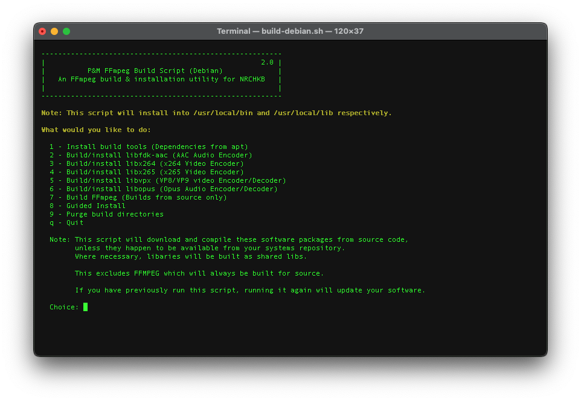

# ffmpeg-build-script

This build script, is to support the NRCHKB project in allowing fully updatable FFmpeg builds.  
It supports Raspberry Pi OS, Ubuntu, Alpine, OSX and multiple CPU architectures (x86, x64, ARM)

Highlights

- FFmpeg 5.0+ (Built for your platform)
- 32 and 64 bit support
- libfdk-aac (Installed via the platform's package manager, or will build from source as a fallback if not available)
- libx264 (Installed via the platform's package manager, or will build from source as a fallback if not available)
- libx265 (Installed via the platform's package manager, or will build from source as a fallback if not available)
- libvpx (Installed via the platform's package manager, or will build from source as a fallback if not available)
- libopus (Installed via the platform's package manager, or will build from source as a fallback if not available)
- h264_v4l2m2m (replaces h264_omx)
- Ability to add extra compile flags
- Automate with command line arguments.

Tested Environments

- **Alpine**

  - 64Bit ARM (VMware Fusion, Apple M1)

- **RPI Bullseye**

  - 64Bit ARM (RPI Zero W2)

- **macOS Ventura**

  - 64Bit ARM (Apple Mac Mini M1)

- **Ubuntu**

  - 64Bit ARM (VMware Fusion, Apple M1)
  - 64Bit AMD/INTEL



# How to Install

Copy the below and paste it in your terminal.

Note: If your OS is Alpine, install `curl` and `bash` first.

```
apk add curl bash
```

Then

```
bash <(curl -sL https://raw.githubusercontent.com/NRCHKB/nrchkb-ffmpeg-build/main/build-bootstrap.sh)
```
